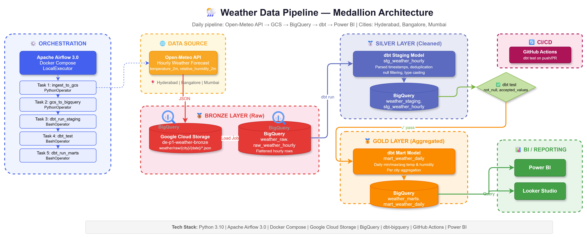

# 🌦️ Weather Data Pipeline — Medallion Architecture

A production-grade **end-to-end data engineering pipeline** that ingests hourly weather data for Indian cities, transforms it through Bronze → Silver → Gold layers, and serves it to BI dashboards.



> Open `docs/architecture.drawio` in [draw.io](https://app.diagrams.net/) or the VS Code Draw.io extension to view the full visual architecture.

---

## 📋 Table of Contents

- [Architecture Overview](#-architecture-overview)
- [Tech Stack](#-tech-stack)
- [Project Structure](#-project-structure)
- [Pipeline Flow](#-pipeline-flow)
- [Data Layers (Medallion)](#-data-layers-medallion)
- [Setup & Installation](#-setup--installation)
- [Running the Pipeline](#-running-the-pipeline)
- [dbt Models](#-dbt-models)
- [CI/CD — GitHub Actions](#-cicd--github-actions)
- [Key Design Decisions](#-key-design-decisions)

---

## 🏗️ Architecture Overview

```
Airflow DAG (runs daily at midnight UTC)
│
├── Task 1: Python script → Open-Meteo API → GCS JSON           (Bronze)
├── Task 2: Python script → GCS JSON → BigQuery raw table        (Bronze in BQ)
├── Task 3: dbt run staging → BigQuery view                      (Silver — cleaned)
├── Task 4: dbt test → validates Silver data quality
├── Task 5: dbt run marts → BigQuery table                       (Gold — aggregated)
└── Task 6: dbt test → validates Gold data quality
                                    ↓
                      Power BI / Looker Studio Dashboard

GitHub Actions (on every Git push):
└── runs dbt test → catches broken models before production
```

### Cities Tracked
| City | Latitude | Longitude |
|------|----------|-----------|
| 🏙️ Hyderabad | 17.38 | 78.48 |
| 🏙️ Bangalore | 12.97 | 77.59 |
| 🏙️ Mumbai | 19.08 | 72.88 |

---

## 🛠️ Tech Stack

| Component | Technology | Purpose |
|-----------|-----------|---------|
| **Orchestration** | Apache Airflow 3.0 (Docker) | Schedule & monitor pipeline tasks |
| **Containerization** | Docker Compose | Run Airflow + PostgreSQL locally |
| **Data Source** | Open-Meteo API | Free weather forecast data |
| **Raw Storage** | Google Cloud Storage (GCS) | Bronze layer — raw JSON files |
| **Data Warehouse** | Google BigQuery | Bronze/Silver/Gold tables |
| **Transformation** | dbt (data build tool) | Silver & Gold SQL transformations |
| **Data Quality** | dbt tests | not_null, accepted_values, schema checks |
| **CI/CD** | GitHub Actions | Automated dbt tests on push |
| **BI / Reporting** | Power BI / Looker Studio | Dashboards from Gold table |
| **Package Manager** | uv | Fast local Python dependency management |
| **Language** | Python 3.10 | Ingestion scripts & Airflow DAG |

---

## 📁 Project Structure

```
DE_P1/
├── docker-compose.yml              # Airflow 3.0 services (Postgres, Scheduler, API Server)
├── Dockerfile                      # Custom Airflow image with Python dependencies
├── requirements.txt                # Python deps for Docker (pip)
├── pyproject.toml                  # Python deps for local dev (uv)
├── uv.lock                        # Pinned dependency versions
├── .env                            # Environment variables (GCP project, bucket)
├── .gitignore
│
├── dags/
│   └── weather_pipeline_dag.py     # Main Airflow DAG — 6 tasks, linear chain
│
├── scripts/
│   └── ingest_weather.py           # Open-Meteo API → GCS ingestion script
│
├── config/
│   └── gcp-key.json                # GCP service account key (git-ignored)
│
├── dbt_project/
│   ├── dbt_project.yml             # dbt project configuration
│   ├── profiles.yml                # BigQuery connection profile
│   ├── macros/
│   │   └── generate_schema_name.sql  # Custom schema naming (no concatenation)
│   ├── models/
│   │   ├── staging/
│   │   │   ├── _staging__sources.yml    # Source: weather_raw.raw_weather_hourly
│   │   │   ├── _staging__models.yml     # Schema tests for Silver
│   │   │   └── stg_weather_hourly.sql   # Silver model (cleaned + deduplicated)
│   │   └── marts/
│   │       ├── _marts__models.yml       # Schema tests for Gold
│   │       └── mart_weather_daily.sql   # Gold model (daily aggregates)
│   └── target/                     # dbt compiled output (git-ignored)
│
├── docs/
│   └── architecture.drawio         # Visual architecture diagram
│
├── plugins/                        # Airflow plugins (empty)
├── logs/                           # Airflow logs (git-ignored)
│
└── .github/
    └── workflows/
        └── dbt_test.yml            # CI: dbt test on push/PR to main
```

---

## 🔄 Pipeline Flow

### Daily Execution (Airflow DAG)

```
┌─────────────────────────────────────────────────────────────────────┐
│                        weather_pipeline DAG                         │
│                     Schedule: @daily (00:00 UTC)                    │
├─────────────────────────────────────────────────────────────────────┤
│                                                                     │
│  Task 1          Task 2          Task 3        Task 4        Task 5│
│  ┌──────┐       ┌──────┐       ┌──────┐      ┌──────┐      ┌──────┐
│  │Ingest│──────▶│ Load │──────▶│ dbt  │─────▶│ dbt  │─────▶│ dbt  │
│  │to GCS│       │to BQ │       │staging│     │ test │      │marts │
│  └──────┘       └──────┘       └──────┘      └──────┘      └──────┘
│  API→GCS        GCS→BQ         Bronze→       Quality       Silver→
│  (Bronze)       (Bronze)       Silver        Check ✓       Gold
│                                                                     │
└─────────────────────────────────────────────────────────────────────┘
```

### API Timing
- **Schedule**: Daily at **midnight UTC** (5:30 AM IST)
- **What it fetches**: Current day's 24-hour forecast using `forecast_days=1`
- **Example**: Triggered on `2026-06-26 00:00 UTC` → gets hourly forecast for `2026-06-26 00:00` to `2026-06-26 23:00`
- **Data volume**: 24 rows × 3 cities = **72 rows per day**

---

## 🏅 Data Layers (Medallion)

### 🥉 Bronze — Raw Data

**GCS Bucket**: `gs://de-p1-weather-bronze/weather/raw/{city}/{date}/`

Raw JSON files directly from the Open-Meteo API, partitioned by city and date.

**BigQuery Table**: `weather_raw.raw_weather_hourly`

| Column | Type | Description |
|--------|------|-------------|
| `city` | STRING | City name (hyderabad, bangalore, mumbai) |
| `latitude` | FLOAT | Weather station latitude |
| `longitude` | FLOAT | Weather station longitude |
| `time` | STRING | ISO 8601 timestamp from API |
| `temperature_2m` | FLOAT | Temperature at 2m height (°C) |
| `relative_humidity_2m` | FLOAT | Relative humidity at 2m (%) |
| `ingested_at` | TIMESTAMP | When the record was loaded |
| `source_file` | STRING | GCS source file path |

---

### 🥈 Silver — Cleaned & Typed

**BigQuery View**: `weather_staging.stg_weather_hourly`

| Column | Type | Description |
|--------|------|-------------|
| `city` | STRING | City name |
| `recorded_at` | TIMESTAMP | Parsed timestamp |
| `temperature_celsius` | FLOAT64 | Cleaned temperature |
| `relative_humidity_pct` | FLOAT64 | Cleaned humidity (0–100%) |
| `weather_date` | DATE | Extracted date |
| `weather_hour` | INT64 | Extracted hour (0–23) |

**Transformations applied**:
- ✅ ISO string → TIMESTAMP parsing
- ✅ Column renaming to snake_case
- ✅ NULL filtering
- ✅ **Deduplication** via `ROW_NUMBER()` — safe for DAG re-triggers

---

### 🥇 Gold — Aggregated for BI

**BigQuery Table**: `weather_marts.mart_weather_daily`

| Column | Type | Description |
|--------|------|-------------|
| `city` | STRING | City name |
| `weather_date` | DATE | Aggregation date |
| `min_temp_celsius` | FLOAT64 | Daily minimum temperature |
| `max_temp_celsius` | FLOAT64 | Daily maximum temperature |
| `avg_temp_celsius` | FLOAT64 | Daily average temperature |
| `min_humidity_pct` | FLOAT64 | Daily minimum humidity |
| `max_humidity_pct` | FLOAT64 | Daily maximum humidity |
| `avg_humidity_pct` | FLOAT64 | Daily average humidity |
| `record_count` | INT64 | Hours recorded (expected: 24) |

---

## 🚀 Setup & Installation

### Prerequisites
- [Docker Desktop](https://www.docker.com/products/docker-desktop/) installed & running
- [Google Cloud SDK](https://cloud.google.com/sdk/docs/install) (`gcloud` CLI)
- GCP project with BigQuery & GCS APIs enabled
- [uv](https://docs.astral.sh/uv/) (optional, for local Python dev)

### 1. Clone & Configure

```bash
git clone https://github.com/your-username/DE_P1.git
cd DE_P1
```

### 2. GCP Setup

```bash
# Create GCS bucket
gcloud storage buckets create gs://de-p1-weather-bronze --location=US

# Create a service account & download key
gcloud iam service-accounts create weather-pipeline \
  --display-name="Weather Pipeline SA"

gcloud projects add-iam-policy-binding gen-lang-client-0461437803 \
  --member="serviceAccount:weather-pipeline@gen-lang-client-0461437803.iam.gserviceaccount.com" \
  --role="roles/storage.admin"

gcloud projects add-iam-policy-binding gen-lang-client-0461437803 \
  --member="serviceAccount:weather-pipeline@gen-lang-client-0461437803.iam.gserviceaccount.com" \
  --role="roles/bigquery.dataEditor"

gcloud projects add-iam-policy-binding gen-lang-client-0461437803 \
  --member="serviceAccount:weather-pipeline@gen-lang-client-0461437803.iam.gserviceaccount.com" \
  --role="roles/bigquery.jobUser"
```

Place the service account key JSON at `config/gcp-key.json`.

### 3. Environment Variables

The `.env` file is pre-configured:
```env
AIRFLOW_UID=50000
GCP_PROJECT_ID=gen-lang-client-0461437803
GCS_BUCKET=de-p1-weather-bronze
GOOGLE_APPLICATION_CREDENTIALS=/opt/airflow/config/gcp-key.json
```

### 4. Build & Start

```bash
docker compose build
docker compose up -d
```

### 5. Local Development (Optional)

```bash
# Install uv if not already installed
pip install uv

# Install dependencies locally
uv sync

# Activate virtual environment
# Windows:
.venv\Scripts\activate
# macOS/Linux:
source .venv/bin/activate
```

---

## ▶️ Running the Pipeline

### Access Airflow UI
- **URL**: http://localhost:8080
- **Username**: `admin`
- **Password**: `admin`

### Trigger DAG
1. Open the Airflow UI
2. Find `weather_pipeline` DAG
3. Click the **Play** button → **Trigger DAG**
4. Monitor task progress in the Graph view

### Verify Results

```sql
-- Check Bronze (raw data)
SELECT * FROM `gen-lang-client-0461437803.weather_raw.raw_weather_hourly` LIMIT 10;

-- Check Silver (cleaned)
SELECT * FROM `gen-lang-client-0461437803.weather_staging.stg_weather_hourly` LIMIT 10;

-- Check Gold (daily aggregates)
SELECT * FROM `gen-lang-client-0461437803.weather_marts.mart_weather_daily` ORDER BY weather_date DESC;
```

---

## 🔧 dbt Models

### Model Lineage

```
Source: weather_raw.raw_weather_hourly (Bronze)
    │
    ▼
View: weather_staging.stg_weather_hourly (Silver)
    │  • Parses timestamps
    │  • Filters nulls
    │  • Deduplicates (ROW_NUMBER)
    │  • dbt test: not_null, accepted_values
    │
    ▼
Table: weather_marts.mart_weather_daily (Gold)
       • Daily min/max/avg per city
       • dbt test: not_null
```

### Custom Macro: `generate_schema_name`

By default, dbt concatenates the profile dataset with custom schema names (e.g., `weather_raw_weather_staging`). The custom macro in `macros/generate_schema_name.sql` overrides this to use exact schema names:

| Without macro | With macro |
|---------------|-----------|
| `weather_raw_weather_staging` ❌ | `weather_staging` ✅ |
| `weather_raw_weather_marts` ❌ | `weather_marts` ✅ |

### Running dbt Locally

```bash
cd dbt_project
dbt run --profiles-dir .            # Run all models
dbt run --profiles-dir . --select staging   # Run only Silver
dbt run --profiles-dir . --select marts     # Run only Gold
dbt test --profiles-dir .           # Run all tests
```

---

## 🔄 CI/CD — GitHub Actions

On every **push to `main`** or **pull request**, GitHub Actions automatically runs:

```yaml
# .github/workflows/dbt_test.yml
- dbt compile   → validates SQL syntax
- dbt test      → runs schema tests
```

### Setup
Add your GCP service account key as a GitHub Secret:
1. Go to **Settings → Secrets → Actions**
2. Create secret: `GCP_SA_KEY`
3. Paste the contents of `config/gcp-key.json`

---

## 💡 Key Design Decisions

### Why Medallion Architecture?
- **Bronze**: Raw data preserved for debugging and reprocessing
- **Silver**: Cleaned data with consistent types and deduplication
- **Gold**: Business-ready aggregates optimized for BI queries

### Why Deduplication in Silver?
If the Airflow DAG is re-triggered (manual retry, backfill), it appends duplicate rows to BigQuery Bronze. The Silver layer uses `ROW_NUMBER() OVER (PARTITION BY city, time ORDER BY ingested_at DESC)` to keep only the **latest** record per (city, hour), ensuring Gold aggregations are always correct.

### Why `forecast_days=1`?
The Open-Meteo API returns forecast data. Using `forecast_days=1` limits the response to just today's 24 hourly readings, keeping the data volume predictable at 72 rows/day (24 hours × 3 cities).

### Why Volume Mounts in Docker?
DAG files, scripts, and dbt models are mounted as Docker volumes. This means code changes on your local machine are **instantly reflected** in the running containers — no rebuild needed for code changes.

---

## 📊 Connecting BI Tools

### Power BI
1. Get Data → Google BigQuery
2. Project: `gen-lang-client-0461437803`
3. Table: `weather_marts.mart_weather_daily`

### Looker Studio
1. Add Data → BigQuery
2. Project: `gen-lang-client-0461437803`
3. Dataset: `weather_marts`
4. Table: `mart_weather_daily`

---

## 📝 License

This project is for educational and portfolio purposes.
